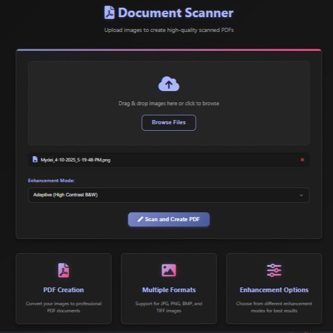
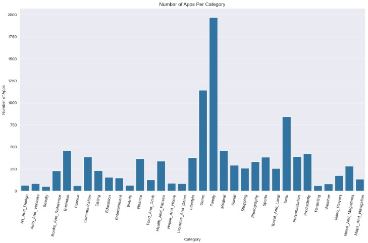
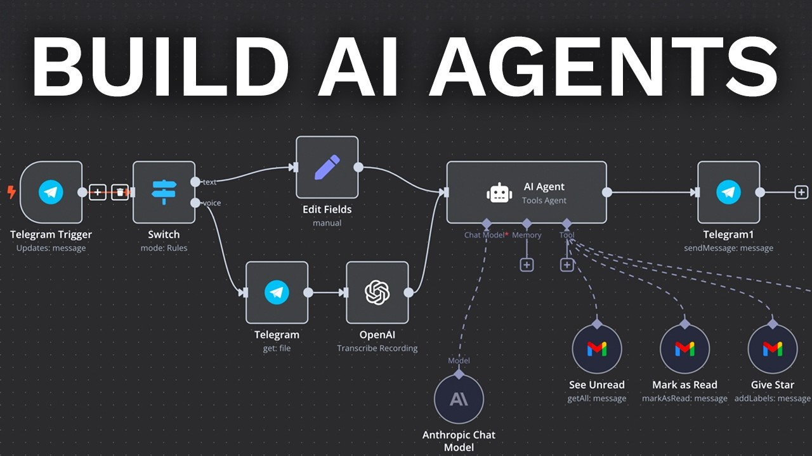

<!--
Credits and references used in this README:

1) Layout ideas and section inspiration:
   https://github.com/abhisheknaiidu/awesome-github-profile-readme?tab=readme-ov-file#descriptive-

2) Skill icons (SVG badges):
   https://github.com/tandpfun/skill-icons?tab=readme-ov-file#icons-list

3) GitHub stats card:
   https://github.com/anuraghazra/github-readme-stats
-->

# 🐐 Soham Chatterjee Account
**`Data & AI Enthusiast`** 

## About Me
- I love to build and learn about all the promising technologies.
- Skilled in Python, SQL, Data Analysis and Data Visualisations.
- Passionate about AI & automation.

## Skill stack
<!-- Skill icons provided by skill-icons. Full icon list and names:
     https://github.com/tandpfun/skill-icons?tab=readme-ov-file#icons-list -->

---

## Projects - Showcase

<table>
  <tr>
    <td align="center" width="33%">
      
       
      <b>Image to PDF Convertor</b> 
      Built an application that can convert any image into pdf. 
      🔗 <a href="https://github.com/VibeCipher/Image2Pdf_Scanner.git">Repo</a>
       
      Tags: AI, Python, OpenCV
    </td>
    <td align="center" width="33%">
      
       
      <b>Cloud CI/CD Pipeline</b> 
      Detailed analysis of all the sales in Goggle Play Store. 
      🔗 <a href="https://github.com/VibeCipher/Google_Play_Store_Analysis.git">Repo</a>
       
      Tags: Analysis, Machine Learning, Visualisation
    </td>
    <td align="center" width="33%">
      
       
      <b>Secure AWS VPC</b> 
      Designed and deployed a custom VPC with public/private subnets and routing. 
      🔗 <a href="https://github.com/VibeCipher/Local_AIAgent_Restaurant.git">Repo</a>
       
      Tags: Python, Ollama, AI Agent
    </td>
  </tr>
</table>

---

## Stats
<!-- Stats card by anuraghazra/github-readme-stats
     Customization guide:
     - Hide private contributions: &count_private=true|false
     - Theme list: ?theme=gruvbox,radical,tokyonight,onedark,dracula etc.
     - Show icons: &show_icons=true
     Docs: https://github.com/anuraghazra/github-readme-stats -->

---

## Links
<!-- Section layout inspired by Awesome GitHub Profile README "Descriptive" patterns:
     https://github.com/abhisheknaiidu/awesome-github-profile-readme?tab=readme-ov-file#descriptive- -->
- [**Portfolio**](https://learn.nextwork.org/happy_maroon_jolly_red_currant/portfolio)
- [**Contact**](mailto:maximus@nextwork.org)

<!-- Optional: fun GIF. Consider replacing with contribution streak or removing for a tighter, more professional finish. -->

